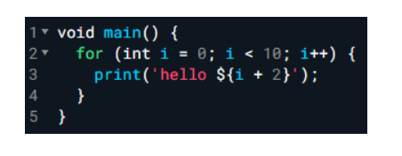
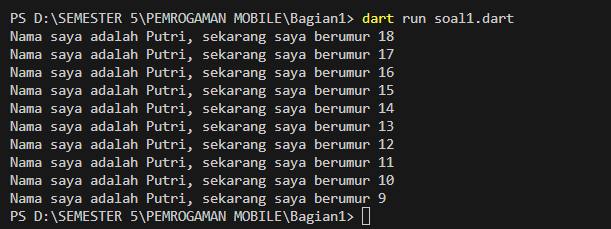

Soal 1
Modifikasilah kode pada baris 3 di VS Code atau Editor Code favorit Anda berikut ini agar mendapatkan keluaran (output) sesuai yang diminta!

Output yang diminta:

>

Hasil:

 > 

Soal 2
Mengapa sangat penting untuk memahami bahasa pemrograman Dart sebelum kita menggunakan framework Flutter ? Jelaskan!
>Karena Flutter adalah framework yang dibangun menggunakan bahasa pemrogaman dart 

Soal 3
Rangkumlah materi dari codelab ini menjadi poin-poin penting yang dapat Anda gunakan untuk membantu proses pengembangan aplikasi mobile menggunakan framework Flutter
>

1. Orientasi Objek (Object-Oriented)
Dart adalah bahasa pemrograman berbasis objek yang mendukung prinsip encapsulation, inheritance, composition, abstraction, dan polymorphism.
OOP di Dart mirip dengan konsep OOP di bahasa lain seperti Java.
2. Operator Dart
Arithmetic Operators: +, -, *, /, ~/, %, - (negasi).
Shortcut Operators: +=, -=, *=, /=, ~/=.
Increment dan Decrement Operators: ++var, var++, --var, var--.
Equality and Relational Operators: ==, !=, >, <, >=, <=.
Logical Operators: !, ||, &&.

3. Function main
Function main adalah titik awal eksekusi dalam program Dart.
Memiliki tipe data pengembalian void, tidak menerima parameter, dan diperlukan dalam setiap aplikasi Dart.

4. Perbedaan Function dan Method
Function: Didefinisikan di luar class dan tidak terkait dengan instance tertentu.
Method: Terikat pada turunan class dan memiliki akses ke instance class melalui this.

5. Menjalankan Kode Dart
Kode Dart dapat dijalankan di DartPad secara online atau di eksekusi secara lokal di PC dengan menggunakan terminal dan perintah dart.

Soal 4
Buatlah slide yang berisi penjelasan dan contoh eksekusi kode tentang perbedaan Null Safety dan Late variabel ! (Khusus soal ini kelompok berupa link google slide)
Link PPT : 
https://docs.google.com/presentation/d/1bg3qqC1g8XSPNLWvx1_JubSeDP9FfPKOj5qDIPKGAMo/edit?usp=sharing